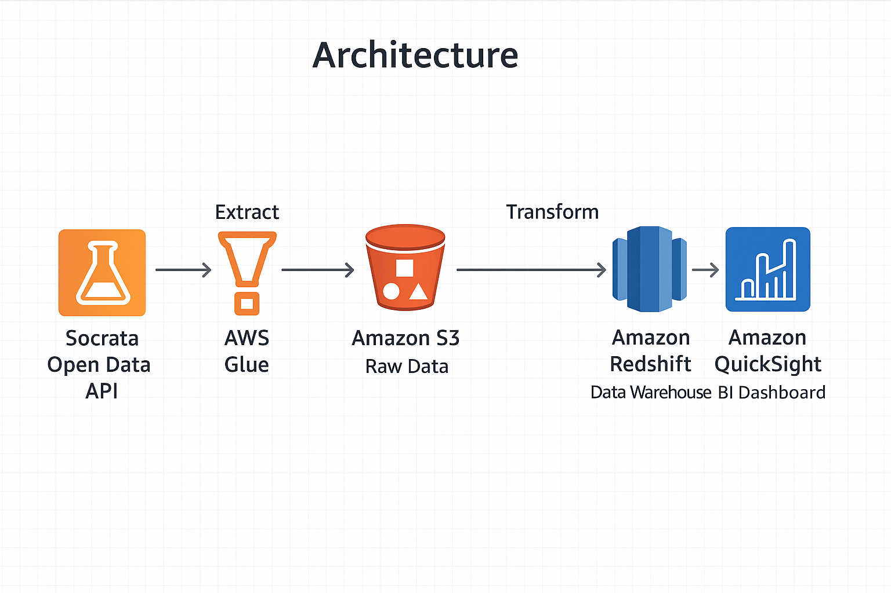

# NYC311 Business Intelligence Project

This project analyzes NYC 311 Service Request data using AWS tools to build a scalable Business Intelligence (BI) pipeline and dashboard environment.
---

## 🚀 Project Goals

- Extract 2025 NYC311 data using the Socrata Open Data API (SODA)
- Stage raw data in AWS S3 in partitioned format
- Load data into Amazon Redshift using a star schema
- Build interactive dashboards using Amazon QuickSight

---

## 🏗️ Architecture

This architecture shows how raw NYC311 data flows from ingestion to visualization

---

## 📅 Data Source

- **Source**: [NYC Open Data – 311 Service Requests (2010–Present)](https://data.cityofnewyork.us/Social-Services/311-Service-Requests-from-2010-to-Present/erm2-nwe9)
- **Date Range Pulled**: January 1, 2025 – June 30, 2025
- **Total Rows**: ~1.73 million
- **Columns**: 16 selected for BI (timestamp, agency, complaint, geo, resolution)

---

## 📦 S3 Data Storage

Raw files have been uploaded to:

s3://nyc311-bi-project-data/raw/311_service_requests/year=2025/

**Contents:**
- `nyc311_2025H1_all.csv` – Combined full dataset (~700MB)
- `nyc311_2025H1_*.csv` – Individual batch files for scalable ETL

> ⚠️ These CSVs are not committed to Git and are excluded using `.gitignore`.

---

## 🧰 Tech Stack

- **ETL**: Python, AWS Glue (planned), Socrata API
- **Storage**: Amazon S3
- **Data Modeling**: Star schema design (fact + dimension)
- **Warehouse**: Amazon Redshift
- **Dashboards**: Amazon QuickSight
- **Languages**: Python, SQL (Redshift), Jupyter
- **Version Control**: Git + GitHub

---

## 📊 Data Warehouse Design

- Loaded `raw_311` into Redshift via S3 using `COPY`
- Created star schema: `dim_date`, `dim_location`, `dim_complaint_type`, `fact_service_request`
- Cleaned duplicates using `vw_raw_311_deduped` view
- Fact table tracks resolution time, location, complaint type, and status

---

## ✅ Current Progress
- ✅ Extracted and cleaned 1.7 M NYC311 records (2025 H1)
- ✅ Uploaded to S3 (raw zone) in both batch and full formats
- ✅ Implemented full star schema in Redshift:
  - `dim_date`, `dim_location`, `dim_complaint_type`, `fact_service_request`
  - Deduplicated source via `vw_raw_311_deduped`
- ✅ SQL scripts added to `scripts/sql/redshift/`
- ⏳ Building KPI queries & connecting Redshift to QuickSight

## 📌 Next Steps
- [ ] Write KPI/aggregation queries (resolution time, top complaint trends)
- [ ] Connect Redshift to Amazon QuickSight
- [ ] Design interactive dashboards (heat map by borough, trend lines)

---

## 📁 Repo Structure (Planned)

nyc311-bi-project/
├── data/
│ └── raw/ # Local CSVs (ignored in Git)
├── scripts/
│ └── glue_jobs/ # ETL logic (Python)
├── sql/
│ └── redshift/ # DDL, COPY, KPIs
├── notebooks/ # Optional: EDA or prototypes
├── dashboards/ # QuickSight assets/screenshots
├── docs/
│ ├── schema_diagram.png
│ └── architecture.png
├── README.md
├── .gitignore
└── requirements.txt

---

Built to showcase practical BI engineering skills using modern AWS and SQL tooling.