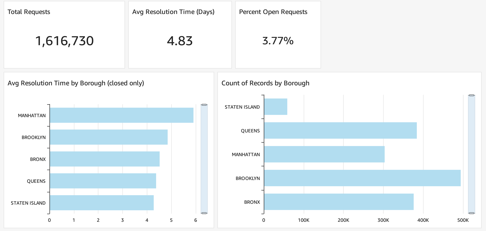
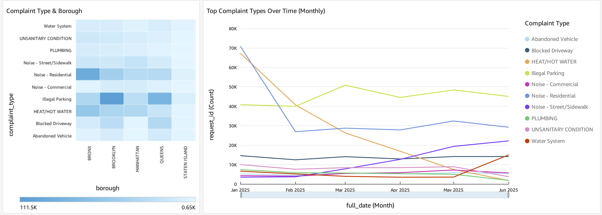

# NYC311 Business Intelligence Project

This project analyzes NYC 311 Service Request data using AWS tools to build a scalable Business Intelligence (BI) pipeline and dashboard environment.
---

## 🚀 Project Goals

- Extract 2025 NYC311 data using the Socrata Open Data API (SODA)
- Stage raw data in AWS S3 in partitioned format
- Load data into Amazon Redshift using a star schema
- Build interactive dashboards using Amazon QuickSight

---

## 🏗️ Architecture

This architecture shows how raw NYC311 data flows from ingestion to visualization

---

## 📅 Data Source

- **Source**: [NYC Open Data – 311 Service Requests (2010–Present)](https://data.cityofnewyork.us/Social-Services/311-Service-Requests-from-2010-to-Present/erm2-nwe9)
- **Date Range Pulled**: January 1, 2025 – June 30, 2025
- **Total Rows**: ~1.73 million
- **Columns**: 16 selected for BI (timestamp, agency, complaint, geo, resolution)

---

## 📦 S3 Data Storage

Raw files have been uploaded to:

s3://nyc311-bi-project-data/raw/311_service_requests/year=2025/

**Contents:**
- `nyc311_2025H1_all.csv` – Combined full dataset (~700MB)
- `nyc311_2025H1_*.csv` – Individual batch files for scalable ETL

> ⚠️ These CSVs are not committed to Git and are excluded using `.gitignore`.

---

## 🧰 Tech Stack

- **ETL**: Python, AWS Glue (planned), Socrata API
- **Storage**: Amazon S3
- **Data Modeling**: Star schema design (fact + dimension)
- **Warehouse**: Amazon Redshift
- **Dashboards**: Amazon QuickSight
- **Languages**: Python, SQL (Redshift), Jupyter
- **Version Control**: Git + GitHub

---

## 📊 Data Warehouse Design

- Loaded `raw_311` into Redshift via S3 using `COPY`
- Created star schema: `dim_date`, `dim_location`, `dim_complaint_type`, `fact_service_request`
- Cleaned duplicates using `vw_raw_311_deduped` view
- Fact table tracks resolution time, location, complaint type, and status

---

### 🧼 Data Integrity
- Total rows in `raw_311`: 1,733,709
- Successfully modeled into fact table: 1,616,767 (~93.3%)
- Dropped due to:
  - Location mismatch: 84,995
  - Complaint mismatch: 39,416
  - ✅ **Pct. loaded into analytics layer**: **93.25%**

---

## ✅ Current Progress

- ✅ Extracted and cleaned 1.7M NYC311 records (2025 H1)
- ✅ Uploaded to S3 (raw zone) in both batch and full formats
- ✅ Implemented full star schema in Redshift:
  - `dim_date`, `dim_location`, `dim_complaint_type`, `fact_service_request`
  - Deduplicated source via `vw_raw_311_deduped`
- ✅ SQL scripts added to `scripts/sql/redshift/`
- ✅ Created [KPI views](scripts/sql/redshift/create_kpi_views.sql) in Redshift
- ✅ Connected Redshift to QuickSight and published SPICE dataset

---

## 📊 Amazon QuickSight Dashboard

#### Executive Summary  

#### Complaint Patterns & Trends  

#### NYC Complaint Density Map  

**Key Features:**
- Total requests, resolution time, and open request % shown as KPI cards
- Monthly trends and complaint breakdowns by borough
- Heatmap of complaint types × boroughs
- Interactive NYC geospatial map of complaint clusters

---
## 📌 Next Steps

- [ ] Add AWS Glue job for incremental data refresh
- [ ] Enhance dashboard with filters and controls (e.g., borough selector)
- [ ] Publish final walkthrough summary and demo link

---

## 📁 Repo Structure

nyc311-bi-project/
├── data/
│   └── raw/                     # Local CSVs (ignored in Git)
├── scripts/
│   ├── glue_jobs/              # ETL logic (Python)
│   └── sql/
│       └── redshift/           # DDL, COPY, KPIs
├── notebooks/                  # Optional: EDA or prototypes
├── dashboards/
│   └── quicksight/             # QuickSight screenshots (sliced PNGs)
├── docs/
│   ├── schema_diagram.png
│   └── architecture.png
├── README.md
├── .gitignore
└── requirements.txt

---

Built to showcase practical BI engineering skills using modern AWS and SQL tooling.